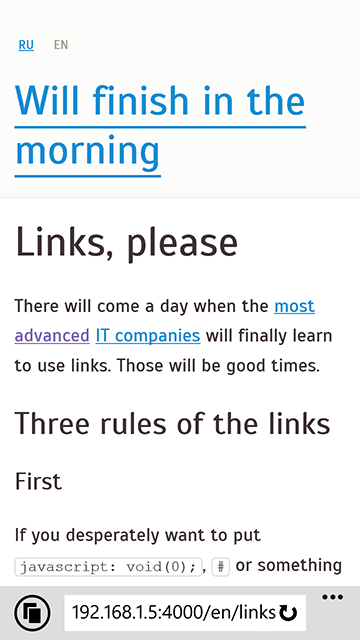
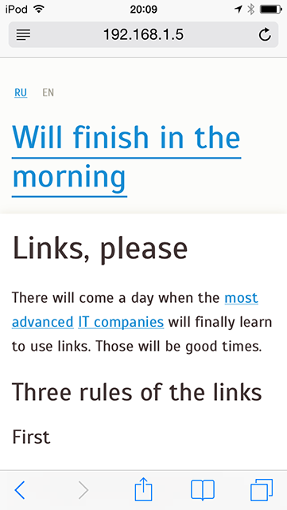

Once Opera's guys proposed to use `@viewport { ... }` in CSS instead of `<meta name="viewport" ...>`. Regarding the
reasons
[you'd better watch and listen to @ppk](http://vimeo.com/100523275) and I will explain why you should use this
right now.

<!-- cut -->

## 1. Proper `viewport` for Windows Phones

I've noticed long ago that websites on Windows Phones look bulky if using landscape more but never deeply thought
about the fact.

You might overlook the difference between iOS and Windows Phone views in portraite mode:

 | 
---------------------------|-------------------------
<div class="article__tip">Windows Phone 8.1</div> | <div class="article__tip">iOS 7</div>

However in the landscape mode the enourmousness of Windows Phone view becomes clear:

 <br/>
<div class='article__tip'>
Windows Phone 8.1
</div>

 <br/>
<div class='article__tip'>
iOS 7
</div>

It turned out that Windows Phone considers usual `<meta name="viewport" content="width=device-width, initial-scale=1">` as a designation to make a viewport 320 logical pixels wide, no matter what real device resolution is (because iPhone).

Instead, fresh and lush `@viewport {width: device-width;}` currently being supported by IE10 and IE11 with prefix
overrides this meta`s value; and moreover — instructs a Windows Phone to use its native viewport resolution.

This is how it should work:

 <br/>
<div class='article__tip'>
Before
</div>

 <br/>
<div class='article__tip'>
After
</div>

The portrait mode also undergoes a change. HTC 8x has better resolution then iPod and same pixel density, so its
viewport should be a little bit wider than 320 pixels:

 | 
-------------------------|-------------------------
<div class="article__tip">Before</div> | <div class="article__tip">After</div>

`@-ms-viewport` was buggy in WP 8 before its third update because it operated with real pixels and not with logical
ones. This caused too large viewport size (and so too small website view) in the retinish phones.

## 2. Responsiveness with Windows 8

Besides, [as it proved](http://timkadlec.com/2013/01/windows-phone-8-and-device-width/), IE in Windows 8 ignores the meta tag in
metro mode but correctly interprets `@-ms-viewport`. Here there are a couple of explanatory GIFs:

 <br/>
<div class='article__tip'>
The web site is zoomed when using meta tag.
</div>

 <br/>
<div class='article__tip'>
The website adapts when using <code>@-ms-viwport</code>.
</div>

In the first case we get a not-adaptive web site. Bad. The second approach gives a mobile version snapped to the edge.
Splendid!

## What do we do?

All the real guys now are doing like this:

```html
&lt;head>
  ...
  &lt;meta name="viewport" content="width=device-width, initial-scale=1">
  ...
&lt;/head>
```

and provide CSS:

```css
@-ms-viewport {
  width: device-width;
}

@viewport {
  width: device-width;
}
```

Advantages:

* Responsiveness in IE Win8
* Native viewport in Windows Phones
* Future-proof!

Drawbacks:

* Viewport at Windows Phone without third update will be broken.

## Related links

* [CSS Device Adaptation](http://dev.w3.org/csswg/css-device-adapt/), W3C
* [The Mobile Viewports](http://vimeo.com/100523275), Peter Paul Koch
* [IE10 Snap Mode and Responsive Design](http://timkadlec.com/2012/10/ie10-snap-mode-and-responsive-design/), Tim Kadlec
* [Windows Phone 8 and Device-Width](http://timkadlec.com/2013/01/windows-phone-8-and-device-width/), Tim Kadlec
