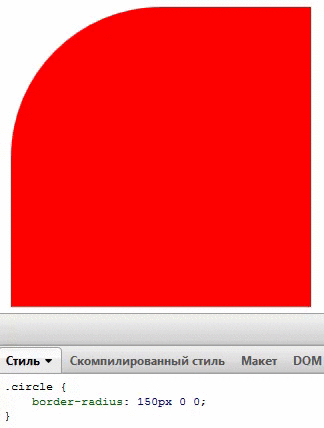
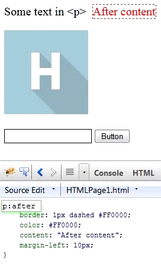
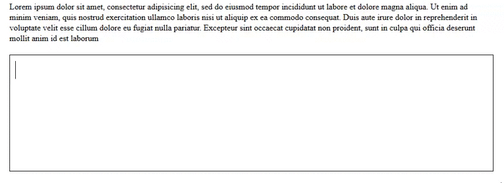

Our development department has a very nice tradition. Every 2 weeks we hold Naked Friday; this is a little conference
where we share interesting knowledge gotten during our work. As a result, we have a lot of such information by now and
so we decided to publish them.

Thus, let me introduce a set of fascinating CSS and HTML tricks, which we hope are not yet well-known. We will be happy
if everyone learn something new!

<!-- cut -->

## Align a block in center and middle

The often solution to this problem is to put a block into 50% position horizontally and vertically with `top` and `left`
properties and then shift it back with negative margins. However there is more accurate and less known trick.

```css
{
    position: absolute;
    top: 0;
    bottom: 0;
    left: 0;
    right: 0;
    margin: auto;
}
```


If you set a position not for an image but for a block, you need to declare its width and hight.

This trick is not working for IE7 but I hope you gave it up long ago :-)

## Cut off long lines with ellipsis

This is quite a mature property (works in IE6!), however it was officially included inly in CSS3 standard. It is not
very often used, so we consider that not everyone is familiar with it.

```css
.text-overflow {
    white-space: nowrap;       /* No line breaks */
    overflow: hidden;          /* Hide text which does not fit the block */
    text-overflow: ellipsis;   /* Cut off with ellipsis */
    display: block;            /* Works only for block elements */
}
```

<style>
.text-overflow {
    white-space: nowrap;       /* No line breaks */
    overflow: hidden;          /* Hide text which does not fit the block */
    text-overflow: ellipsis;   /* Cut off with ellipsis */
    display: block;            /* Works only for block elements */
}

.column {
  width: 250px;
  border: red 1px solid;
  padding: 1em;
}

</style>

<div class="column">
    <div class="text-overflow">
        Articles and blog posts from all over the world
    </div>
</div>

You can define block width, but by default it is as wide as its parent block. So, ellipsis is shown if the block
is wider than its container. This works only for single lines.

## Blocks with dependant width

Let's say you want to have a sidebar.

```html
&lt;aside class="panel">
    ...
&lt;/aside>
&lt;div class="content">
    ...
&lt;/div>
```

And the main content width depends only on the sidebar width. How do you do this without declaring width? There is the way out!

```css
.content {
    overflow: hidden;
}
.panel {
    float: right;
    width: 20%;
}
```


As you can see `overflow: hidden` solves the problems.

## Elliptic corners

Only a few know (or at least not may use) that `border-radius` property accepts not 4 but 8 parameters; 2 per corner.
The first one defines horizontal radius, and the second defines vertical one. For example:

```css
.circle {
    border-radius: 150px/100px 100px/200px 0 0;
}
```



## A little bit about pseudo elements

Pseudo elements `:before` and `:after` overlay the element they belong to. In case you need them to be under the parent,
set negative `z-index` property to them.

Also, pseudo element do not work with tags which are not supposed to have text content; such as ``, `<br>` and
strangely enough `<input>`.



However `<hr>` works normally with pseudo elements for some reason.

## Bonus: little Firebug with pure HTML

Just put this code into your page:

```html
&lt;style contenteditable style="display: block; border: 1px solid black; width: 90%; height: 300px; position: fixed;
bottom: 50px; left: 5%;">&lt;/style>
```



Whoohoo! Everything works, thanks to HTML5!

This this is almost useless. however if it is styled to have big font-size, it can come in handy for the presentations.
Not all of us can easily make out the small letters of the real Firebug.

This is all for today. Thank you for your attention! We are looking forward for your comments!
